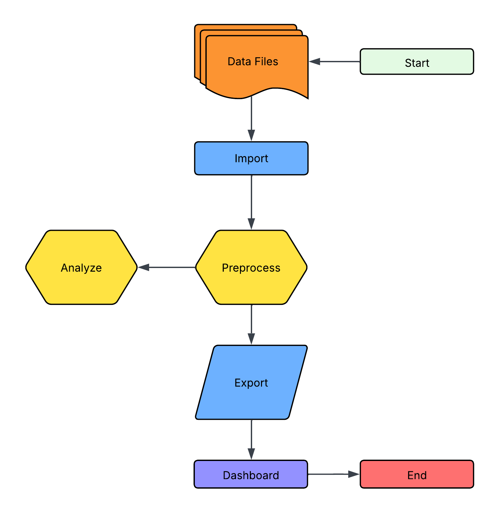
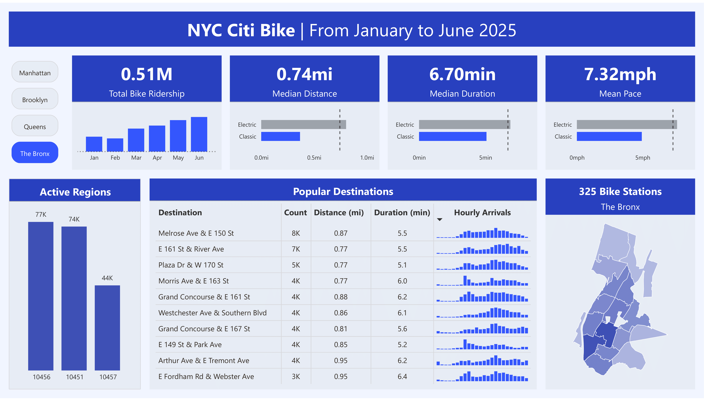

# Citi Bike Dashboard

## A dashboard on the Citi Bike rides from Jan-Jun 2025

The Citi Bike provides free and accessible data on trips and stations at [**Citi Bike - System Data**](https://citibikenyc.com/system-data).

There are 5 boroughs in NYC and 4/5 that support the use of Citi bikes. These boroughs are:

- Manhattan
- Brooklyn
- Queens
- The Bronx

With this dashboard, state members, city officials, and company stakeholders are able to adjust bike funding, optimize marketing campaigns, and understand its users.

## Project Workflow

This is a diagram created in [**Lucidchart**](https://www.lucidchart.com/) that shows the workflow before building the dashboard:

  

## Interesting Findings

- About 90% of rides have a membership with Citi Bike
- The Bronx has more electric rides compared to the other boroughs
- The popular ride hours are 7-9am and 4-7pm
- On average, casual users travel further and spend more time on the bikes

## Power BI Dashboard

The dashboard provides city officials, analysts, and other stakeholders with an intuitive way to explore usage patterns, identify high-performing areas, and make data-driven decisions for future investments and service improvements:

  

**Visuals With a Tooltip**

- Active Regions
- Map

## Next Steps
1. Automating the dashboard to update as new data is uploaded
2. Deploy an app
3. Gain access to more information on users and bike stations