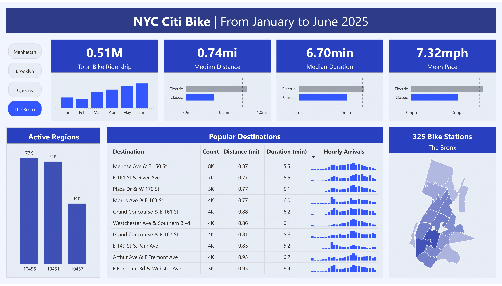

# 🚲 NYC Citi Bike Project

Citi Bike stations cover NYC boroughs and are widely used by both locals and tourists. Thousands of daily trips support commuting, exercise, leisure, and city exploration. 

This project analyzes Citi Bike trip data across NYC to uncover usage patterns, user behavior, and borough-specific performance.

**How is this helpful?**

- The city can make decisions on popular places to invest in
- Understand the rider's behavior and patterns
- Develop marketing campaigns towards local residents

## Data Information

The dataset is updated regularly on an AWS S3 bucket.

For the sake of time, files from January to June 2025 were used.

## Data Analysis

Analyzing the data enabled me to comprehend the large dataset and design a dashboard in Power BI. The analyses can be found in the `notebook` folder.

There's information on the boroughs supporting Citi Bikes and insights on rider behavior. 

The distributions of trip duration and distance allowed the use of correct statistics, such as using the median instead of the mean. 

## Dashboard

**Objective:** Understand each borough and rider's behavior

Modeling the data and designing the dashboard was difficult and required several iterations. 

The dashboard provides city officials, analysts, and other stakeholders with an intuitive way to explore usage patterns, identify high-performing areas, and make data-driven decisions for future investments and service improvements.

## Next Steps
1. Automating the dashboard to update as new data is uploaded by Citi Bike
2. Deploy an app that can be used by city officials
3. Gain access to more information on users, boroughs, and bike stations